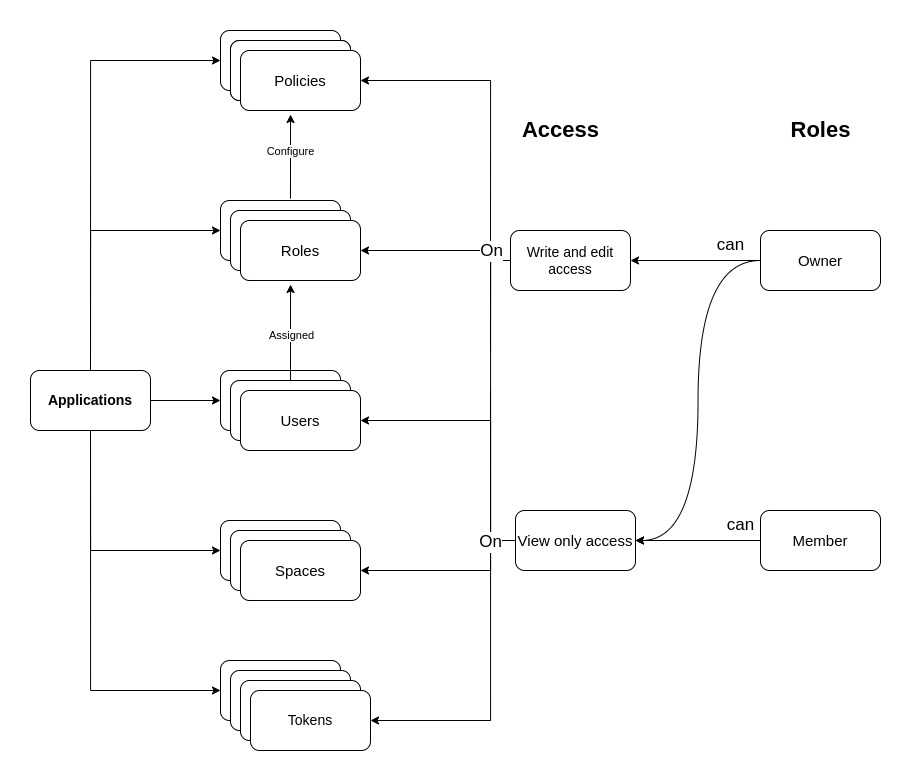

# Application

Application is an mid-level entity in Kavach. Users can add/extend there application in Kavach. Application of a particular organisation can be accessed only by the users of that organisation. 

#### An application has following entities:
- **Users**
- **Spaces**
- **Tokens**
- **Roles**
- **Policies**

The role based access in application is inherited from the organisation i.e. if you are owner in the organisation then you will be owner in application too and vice versa.

- For adding a new application, one has to navigate to the Applications page of Kavach and click ```New Application```  action   on the right side and fill out the form.

### The flow diagram for application:




Following are the details required for adding a new application:
1. Name
2. Slug
3. Logo
4. Description
5. URL

Currently application has 3 actions -
- goto - ( it takes user to the application's URL )
- edit - ( it takes you to the application edit page )
- delete - ( it deletes the application )


For adding Factly applications, user can click on the *[Add Factly Application](https://factlylabs.com/)* button on the right side.

- You can create roles and policies in organisation. For more details check - [**Roles**](/docs/core-concepts/roles) and [**Policies**](/docs/core-concepts/policies).