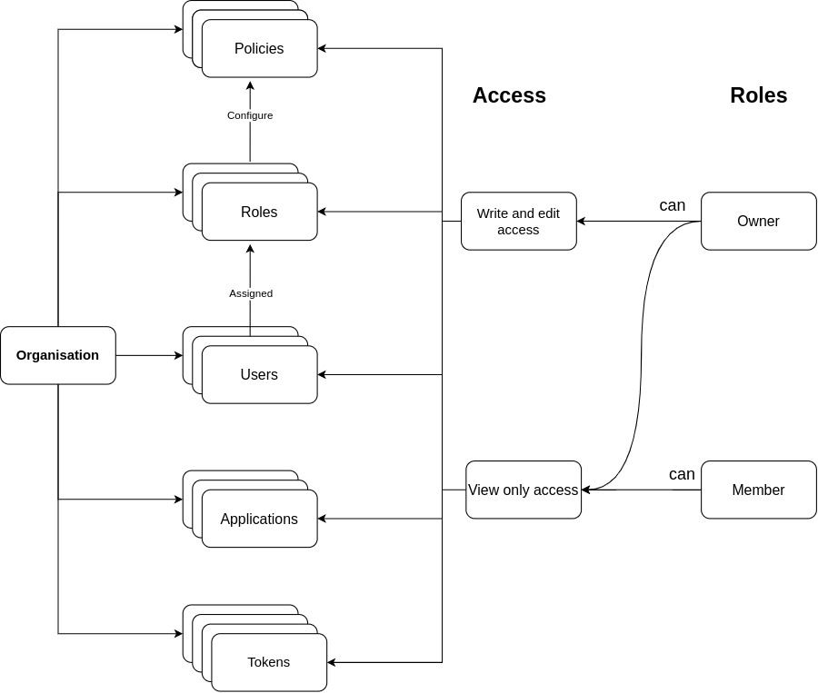

# Organisation

An organisation is an entity which comprises of Applications, Users and Tokens. Creating or being part of an organisation is mandatory for accessing features of Kavach.

#### An organisation has following entities:
- **Users**
- **Applications**
- **Tokens**
- **Roles**
- **Policies**

There are two default roles in Kavach - [**Owner**](/docs/core-concepts/roles) and [**Member**](/docs/core-concepts/roles).
- **Owner:**  Owners have special privileges in an organisation. They can invite/remove users and carry out CRUD(create read update delete) operations on tokens, roles and policies. They can also edit details of an organisation.
- **Member:** Members have read-only privileges in an organisation. They can view organisation details and access entities of an organisation.

### The flow diagram for organisation:

Organisations can be created from the organisation menu item by clicking on the *New Organisation* action on the right side.
Following details are required to create an organisation:
1. Title
2. Slug
3. Decription
4. Logo 

- Basic settings for organisation can be configured by the owners of organisation on the settings page. 

- You can create roles and policies in organisation. For more details check - [**Roles**](/docs/core-concepts/roles)
 and [**Policies**](/docs/core-concepts/policies).