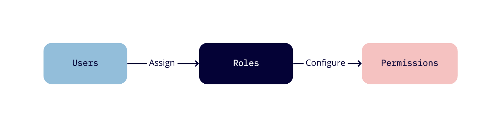

# Policies

## What is a Policy?
A policy is an entity which controls which actions a role can perform on an entity i.e. it control permissions and privileges of roles in an organisation, application or space. 



A policy mainly consists of 3 things - 
- Resource on which actions will be performed
- Action - action to be performed on resource. Example - read, write, update, publish, etc.
- Roles - role which will carry out the action on the resource.
  
In Kavach you can create policies at all levels. For creating policies Kavach takes help of ORY Keto. For more details about ORY Keto you can [click here](https://www.ory.sh/docs/keto/).

## Policies in Kavach
- In Kavach, you can create, delete, update and verify the policies. <br/>
- For creating policy in Kavach you need to specify the following:
    - Name of the policy
    - Description of the policy
    - Resources involved in the policy
    - Actions to be performed on the resources
    - Roles performing the actions

## Verifying policies in Kavach?
- You can also check whether a particular action can be performed on a particular resource or not. 
- Endpoints to verify the policy
    - at organisation level : <br/>``` http://KAVACH-SERVER-URL/organisations/{organisation_id}/policy/allowed```
    - at application level : <br/>``` http://KAVACH-SERVER-URL/organisations/{organisation_id}/applications/{application_id}/policy/allowed```
    - at space level : <br/>``` http://KAVACH-SERVER-URL/organisations/{organisation_id}/applications/{application_id}/spaces/{space_id}/policy/allowed```

- Request body for verifying policies - 
 ```
  struct {
	Subject string 
	Action  string 
	Resource string 
}
 ```
- Response is boolean.


