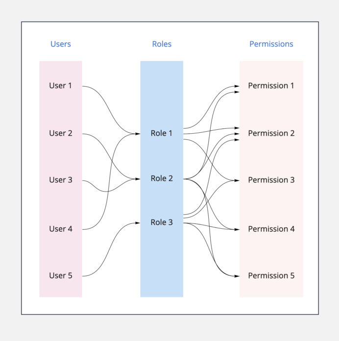

# Roles
Roles are used to define functional categories for users. In Kavach, there are two kinds of roles -  *Default Kavach Roles*  and *Custom Kavach Roles*. Roles are present at all levels in Kavach. 

## Default Kavach Roles 
Default Kavach Roles can only be created at Organisation level. The organisation role is inherited by applications and spaces as there respective roles.

Organisation users are divided into two categories:
1. Owner
2. Member
- **Owner:**  Owners have special privileges in an organisation. They can invite/remove users and applications. They can also edit details of an organisation.
- **Member:** Members have read-only privileges in an organisation. They can view organisation details and access applications of an organisation.

## Custom Kavach Roles 
Custom Kavach Roles can be created at all levels. If a particular used case needs more variety of role for their application, then they can create custom roles and integrate them with there application.

For creating custom roles in Kavach you need:
- Name of the role
- Description of the role

These roles are then combined with [**policies**](/docs/core-concepts/policies) for assigning permissions to have role based access control (RBAC) over entities at each levels.

