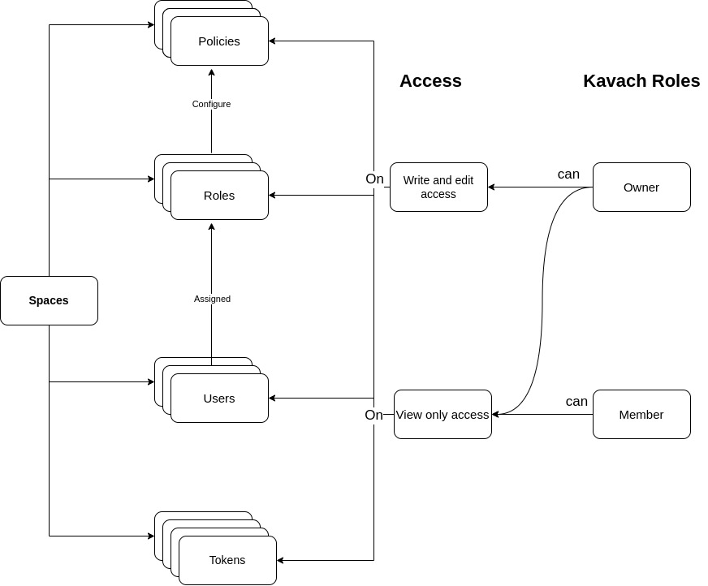

# Space

Space is the lowest level entity in Kavach. It acts as a multitenancy component in application. You can divide the application into multiple spaces.
#### Similar to Application, Space also has following entities:
- **Users**
- **Tokens**
- **Roles**
- **Policies**

### The flow diagram for space:

- You can create roles and policies in organisation. For more details check - [**Roles**](/docs/core-concepts/roles) and [**Policies**](/docs/core-concepts/policies).

