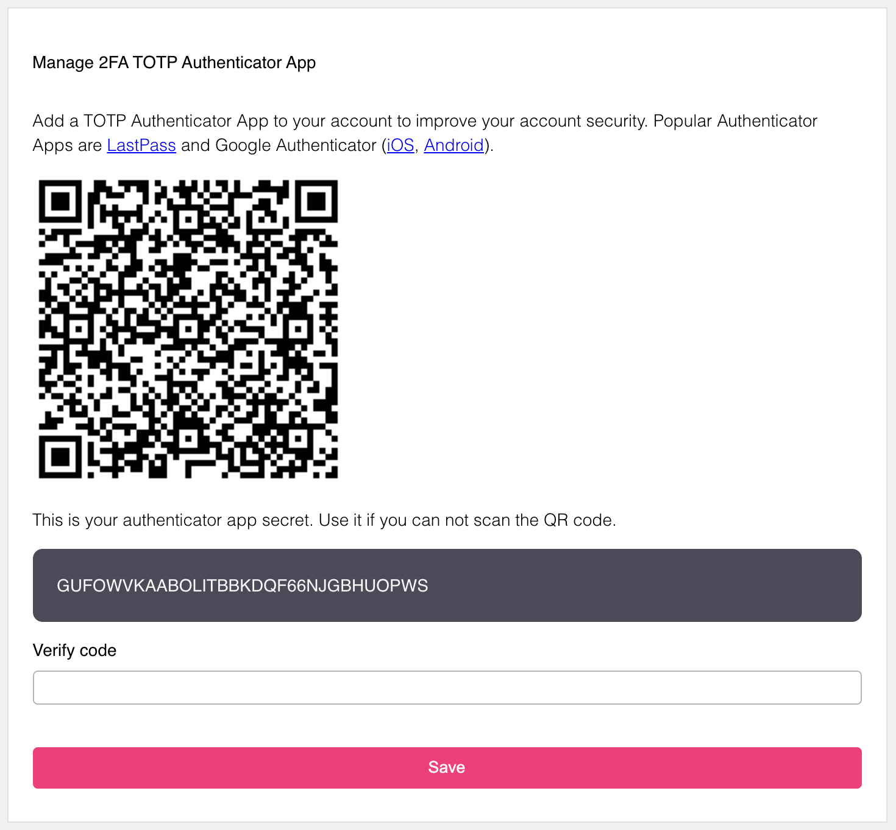

# Activating Two Factor authentication in Kavach

For activating Two Factor authentication, click on the user icon on the upper-right side and then go to the profile page. On the profile page you will see the below image:

- Scan the QR-Code with the authenticator app. Some of the popular authenticator apps are Google authenticator, LastPass, Bitwarden, etc.
- If you can't scan the QR code then enter the secret key.
- Click on save.
- You will be redirected to login screen to enter the password to complete the action.
- After successfully activating it, you will get the message of "Your changes were saved.".